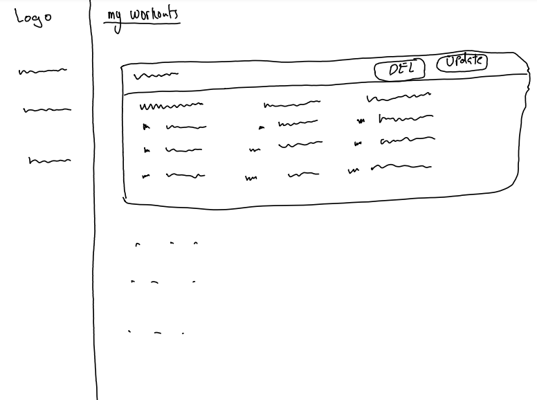
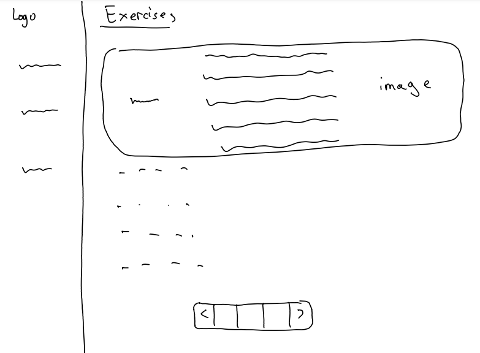
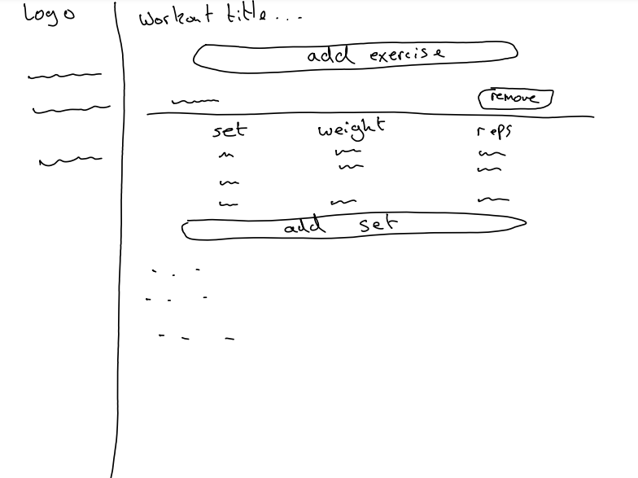
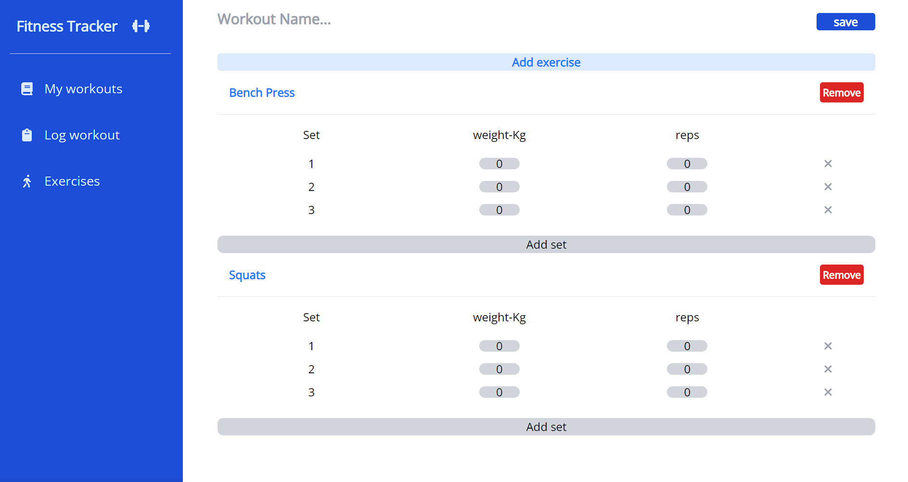

# Fitness Tracker

# Description

The fitness tracker is a single-page web application built using React.js. It allows users to track their workouts in the gym and as well as search for exercise information such as the correct form.

Deployment Link: https://fitness-tracker-react.herokuapp.com/

# Getting Started/Code installation

To access the code on your machine run:

```
$git clone https://github.com/maxim-pre/fitness-tracker.git
```

Navigate into repository then run:

```
$npm install
```

# Timeframe

This was an **individual project** that was developed in **4 days** as part of a software engineering bootcamp with **GeneralAssembly**

# Technology used

- **JavaScript XML**
- **Javascript**
- **Tailwind css**
- **React.js**
- **Version control software**

  - **Git** software ran locally on my PC to keep track of project changes

  - **GitHub** cloud based hosting service allowing me to manage the repository remotely

- Developer Tools
  - **Ubuntu** used to interact with project
  - **Visual Studio Code** IDE used to write code for this project
  - **Google Chrome** - Used developer tools for debugging and displaying application
  - **Pesticide** - Outlines rendered components which helped with formatting.

# Brief

## General

- **Build a web application from scratch**, without a starter codebase. Must be your own work.
- **Use React with create-react-app** to build your application.
- Plan your application using wireframes and user stories.
- **Craft a README.md file that explains your app** to the world.
- **Deploy your app online**, where the rest of the world can access it.

## Technical

- Add a new item to a list.
- Mark the item as complete/favourite.
- Edit an item from a list.
- Remove an item from a list.
- Clear/Delete all items.
- Fetch data from at least one 3rd party API using Axios or fetch.
- Make frequent commits with descriptive messages, explaining your commit.
- Use React Router to handle multiple pages/views.

# Planning

Planning this project involved drawing wireframes and writing users stories. The wire frames gave me a clearer vision of how the different webpages would look and interact with each other. The user stories helped me understand how the user would want to use a fitness tracker.

### WireFrames

### My workouts Page



### Exercises Page



### Log new workout Page



### User Stories

- As a user I should be able to search for exercises I'm interested in to get information about how to perform the exercise properly.

- As a user I should be able to log all the exercises I performed at the gym to keep track of my workouts.

- As a user I should be able to log all sets I performed for each exercise at the gym to keep track of my workouts.

- As a user I should be able to log the weight and reps for each set at the gym to keep track of my workouts.

- As a user I should be able to view a list of all my logged workouts in chronological order so I can have a record of my workouts

- As a user I should be able to update a logged workout in case I recorded the wrong exercise, sets, etc.

- As a user I should be able to delete a logged workout so I can manage my workouts log.

# Build/Code process

-- webpage structure

The first goal I had in development was to setup my content area. The side nav and mobile nav bars appear on each webpage so I started so I started with those.

```jsx
function App() {
  return (
    <div>
      <MobileNavBar /> // mobile Nav
      {nav && <MobileNav />} //mobile nav menu
      <Nav /> // side nav
      <div className="flex-1 p-4">// Content Area</div>
    </div>
  );
}
```

-- fetching and processing api data

Fetching all the exercise data I needed required two api calls.

1. first to the exercises endpoint to grab exercise names and description
2. second to the exercise images endpoint to grab corresponding images

The problem was that not all exercises had images, so I had to filter exercises to the ones that matched a foreign key field with the exercise images called 'exercise base'

After processing the data I saved a list of all valid exercises to the state with only the:

1. exercise name
2. exercise description
3. exercise image url

```js
const [exercises, setExercises] = useState([]);

useEffect(() => {
  fetch("https://wger.de/api/v2/exercise/?language=2&limit=1000")
    .then((response) => {
      return response.json();
    })
    .then((result) => {
      const exercises = result.results;
      fetch("https://wger.de/api/v2/exerciseimage/?limit=1000")
        .then((response) => {
          return response.json();
        })
        .then((result) => {
          const exerciseImageObjects = result.results;
          const validExerciseBases = exerciseImageObjects.map((image) => {
            return image["exercise_base"];
          });

          const validExercises = exercises.filter((exercise) => {
            return validExerciseBases.includes(exercise["exercise_base"]);
          });

          const validExerciseWithImage = validExercises.map((exercise) => {
            const imgObj = exerciseImageObjects.find((img) => {
              return (
                img["exercise_base"] === exercise["exercise_base"] &&
                img["is_main"] === true
              );
            });
            return { ...exercise, image: imgObj["image"] };
          });

          const stateExercises = validExerciseWithImage.map((exercise) => {
            return {
              name: exercise.name,
              description: exercise.description,
              img: exercise.image,
            };
          });
          setExercises(stateExercises);
        });
    });
}, []);
```

-- workout model

When a user submits a workout in the 'Log Workout' page, they are pushing a workout object to the workouts array in local storage.

Below is how I structured this workout object.

```js

workout = {
    name: ''
    exercises: [
        {name:'', sets: [
            {reps: 0, weight: 0}
        ]}
    ]
}


```

# Challenges

The main challenge during this project was working with the 3rd party API. Getting all the data I wanted was a challenge because not all exercise descriptions were in English and not all the exercises had images. This resulted in a long fetch function which made the application slow when it was first rendered. Going forward I would like to focus more on improving the efficiency of fetch requests to improve the user experience.

# Wins

Overall I am very pleased with what I was able to achieve in 4 days. I am especially pleased with my implementation of the form to record a new work out. In my opinion its an intuitive design and it makes it easy for users to construct their exact workout.



# Key Learnings/Takeaways

Going into this project I really wanted to focus on improving my styling skills. I found that I really enjoyed using tailwind CSS over vanilla CSS because it removes the need for extra files which makes organisation simpler and I much prefer writing styles on the elements themselves.

# Future improvements

- I would like to add the ability for users to create workout templates so that users don't have to manually create new workouts if they are completing the same workouts at the gym, but can instead change the weight and reps.

## Resources

- Google Fonts - https://fonts.google.com/specimen/Caveat
- Font awesome - https://fontawesome.com/search?q=x&o=r
- Exercises API - https://wger.de/en/software/api
